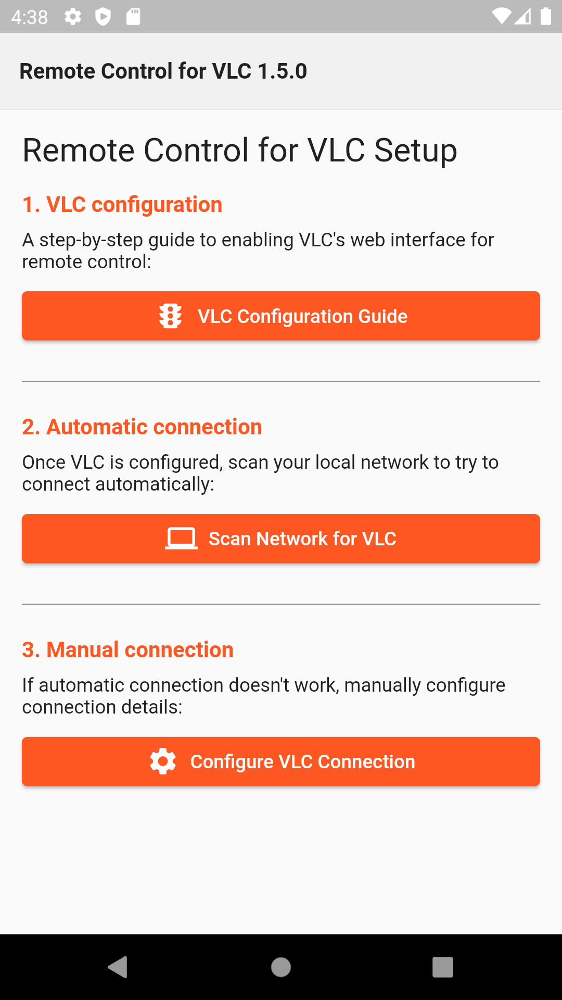
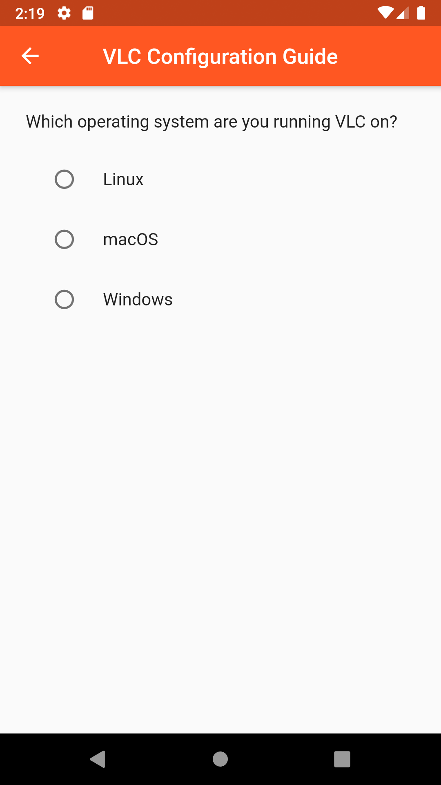
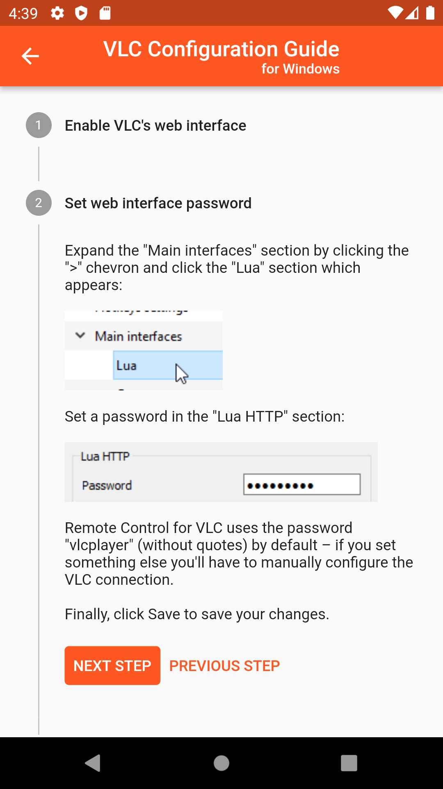
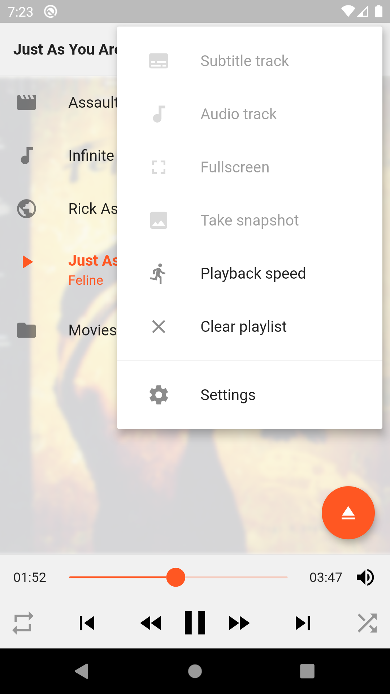
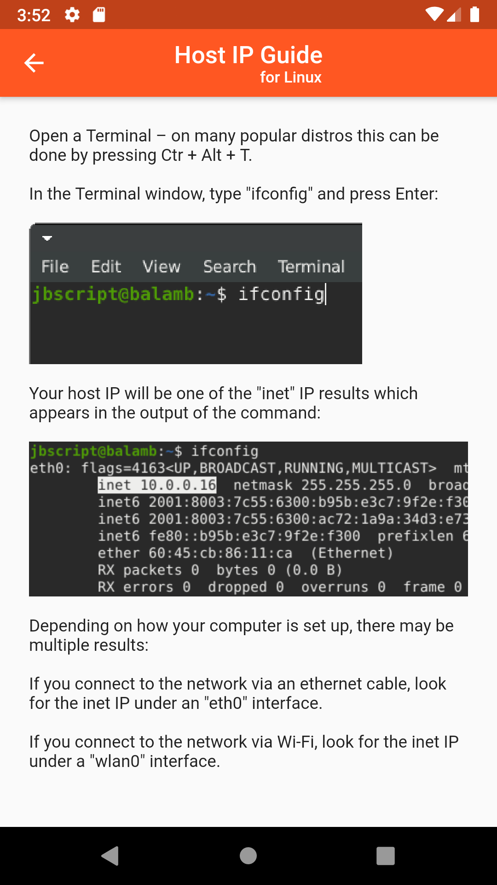
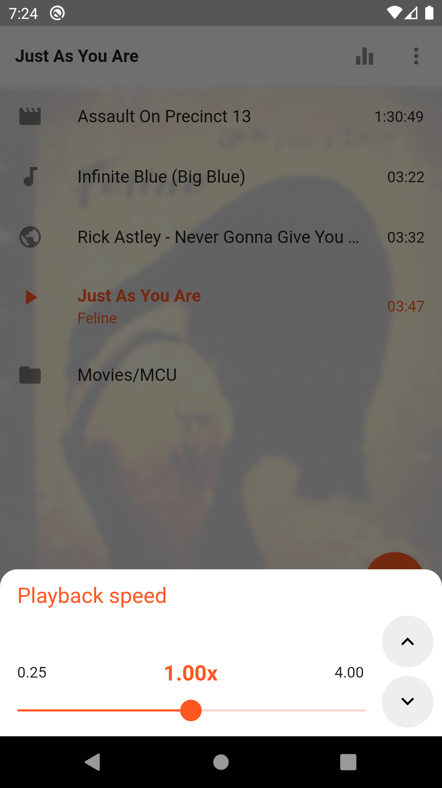

# VLC Remote

A [VLC](https://www.videolan.org/vlc/) remote control written with [Flutter](https://flutter.io/).

## Initial Setup Guides

The first time you start VLC Remote, it will provide a guide to setting up VLC's web interface
 for remote control and will give you the option to try to discover the IP of the host VLC is
  running on automatically.

The app's guides for initial VLC configuration and finding your host IP if it can't be found
 automatically are also available here if you need to reference them on a computer:

### [VLC Remote Configuration Guides](https://codepen.io/jbscript/full/BaoVYYK)

## Demo

## Screenshots

## Initial setup screens

| Setup screen  | Choose OS for setup guide | Setup guide | Connected |
| ------------- | ------------------------- | ----------- | --------- |
|  |  |  |  |

### Browsing for and playing media

| Open media  | File browser | Playlist | Playlist Menu |
| ----------- | ------------ | -------- | ------------- |
|  |  |  |  |

### Settings

| Settings screen  | Host IP guide | Equalizer | Playback Speed |
| ---------------- | ------------- | --------- | -------------- |
|  |  |  |  |
