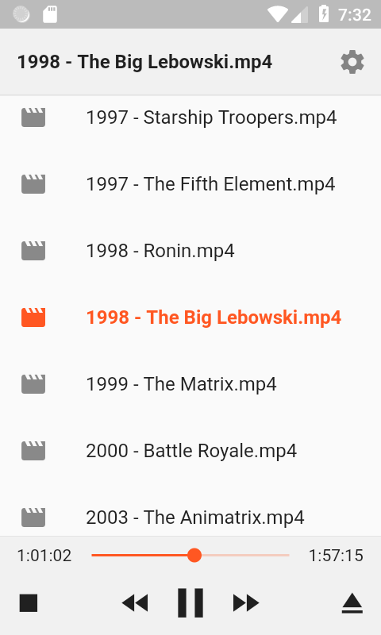

# VLC Remote

A [VLC](https://www.videolan.org/vlc/) remote control written with [Flutter](https://flutter.io/).

## Setup

### Configure VLC on your computer

1. First, you will need to start VLC's built-in server for VLC Remote to connect to.

   Open VLC's preferences (**Tools → Preferences** on Windows/Linux), find the **"Show settings"** section and click **"All"** to view advanced settings:

   

2. Scroll down to find the Interface → Main interfaces settings and check the **"Web"** option:

   

3. Switch to the Interface → Main interfaces -> Lua settings and set a password for the VLC server in the "Lua HTTP" section:

   VLC Remote uses **vlcplayer** as its default password - if you set this now, you'll have one less thing to configure later.

   

4. Finally, restart VLC and open VLC Remote on your phone.

### Connect to VLC from VLC Remote

Use the cog icon in the title bar to open the Settings screen.

For initial setup, VLC Remote will try to pre-fill the start of your LAN IP in the Host IP section.

You will need to look up your computer's IP address and configure it here:

Looking up your IP on Windows

- Open a Command Prompt
- Type `ipconfig` and press enter to
- Look for `IPv4 Address` in the command's output, which should have an IP address similar to the Host IP setting in the app

Looking up your IP on Linux/Mac

- Open a Terminal
- Type `ifconfig` and press enter to
- Look for `eth0` in the command's output, which should have an IP address similar to the Host IP setting in the app

Once you've configured the Host IP address (and the Password if you didn't use `vlcplayer`) click the Test Connection button.

If VLC Remote was able to successfully connect, the connection info will be saved.

## Screenshots

### Settings

### Status and control of media already running on VLC

### Browsing for and playing media

When you browse for and select media, the contents of the directory it was in are displayed as a playlist.

